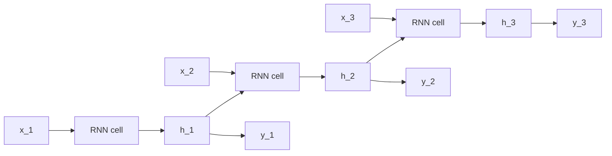
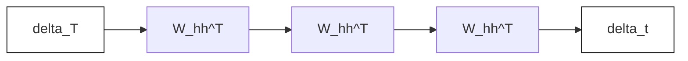

# A05 — Recurrent Neural Networks from Scratch (PyTorch)

## Overview

This assignment builds a character-level language model using manual RNN and
LSTM cells in PyTorch. You may **not** use `nn.RNN`, `nn.LSTM`, or `nn.GRU`.
You must implement the recurrence manually inside your own `nn.Module`.

The task is language modeling on **tinyshakespeare** (Karpathy). Given a
sequence of characters, predict the next character at each time step. You will
train both a vanilla RNN and an LSTM, compare perplexity, and generate text to
see the difference in long-range coherence.

This assignment bridges into A06 (Attention from Scratch): you will see how
long-range dependency failures motivate attention.

---

## Theory

### Why feedforward networks fail on language

An MLP sees one input and produces one output. It has no memory of the past, so

RNNs solve this by introducing a hidden state $h_t$ that summarizes everything



### The Elman RNN (char-level LM)

At each time step $t$:

$$a_t = W_{xh} x_t + W_{hh} h_{t-1} + b_h$$
$$h_t = \tanh(a_t)$$
$$z_t = W_{hy} h_t + b_y$$
$$p_t = \text{softmax}(z_t)$$

where:
- $x_t \in \mathbb{R}^V$ is the current character (one-hot or embedding),
- $h_t \in \mathbb{R}^H$ is the hidden state,
- $z_t \in \mathbb{R}^V$ are logits, $p_t$ is the predicted distribution,
- $V$ is vocabulary size and $H$ is hidden size.

Parameter shapes:

| Parameter | Shape | Role |
|---|---|---|
| $W_{xh}$ | $H \times V$ | input to hidden |
| $W_{hh}$ | $H \times H$ | hidden to hidden |
| $b_h$ | $H$ | hidden bias |
| $W_{hy}$ | $V \times H$ | hidden to logits |
| $b_y$ | $V$ | output bias |

The key feature is **weight sharing**: the same parameters apply at every

```mermaid
flowchart LR
  xt[x_t] --> Wxh[W_xh]
  ht1[h_{t-1}] --> Whh[W_hh]
  Wxh --> at[a_t]
  Whh --> at
  at --> ht[h_t = tanh(a_t)]
  ht --> Why[W_hy]
  Why --> zt[z_t]
  zt --> pt[softmax]
```

### Weight initialization and symmetry

We use Xavier (Glorot) initialization: $W \sim \mathcal{N}(0, 2/(n_{in}+n_{out}))$.
This keeps activation variance stable through time. Biases start at zero.
Random initialization breaks symmetry; if all weights were equal, every hidden
unit would learn the same feature and the model would collapse.

### Loss: cross-entropy and perplexity

At each time step we predict a distribution over the next character:

$$\mathcal{L}_t = -\log p_t(y_t)$$

The total loss over a sequence is $\mathcal{L} = \sum_t \mathcal{L}_t$. This is

Perplexity is the exponential of the average cross-entropy:

$$\text{PPL} = \exp\left(\frac{1}{T}\sum_{t=1}^T \mathcal{L}_t\right)$$

Lower perplexity means better predictive uncertainty. A perplexity close to $V$
means the model is guessing uniformly at random.

### Backpropagation Through Time (BPTT)

Because parameters are shared, gradients sum across time:

$$\frac{\partial \mathcal{L}}{\partial \theta} = \sum_{t=1}^{T} \frac{\partial \mathcal{L}_t}{\partial \theta}$$

Define the error signals:

$$\delta_t^y = \frac{\partial \mathcal{L}_t}{\partial z_t} = p_t - y_t$$
$$\delta_t^h = W_{hy}^\top \delta_t^y + W_{hh}^\top \delta_{t+1}^a$$
$$\delta_t^a = \delta_t^h \odot \tanh'(a_t)$$

The hidden state $h_t$ affects loss in **two** ways: directly via the output
at time $t$, and indirectly via the next step’s recurrence. Missing the second
term is the most common BPTT bug.

```mermaid
flowchart RL
  yloss[L_t] --> dy[delta_t^y]
  dy --> dh1[W_hy^T]
  dn[delta_{t+1}^a] --> dh2[W_hh^T]
  dh1 --> dh[delta_t^h]
  dh2 --> dh
  dh --> da[delta_t^a = delta_t^h * tanh'(a_t)]
```

### Vanishing and exploding gradients

Unrolling shows repeated multiplication by $W_{hh}^\top$:

$$\delta_t^a \propto (W_{hh}^\top)^{T-t} \delta_T^a$$

If eigenvalues are $> 1$, gradients explode. If $< 1$, they vanish. The
tanh derivative is in $(0, 1)$, making vanishing more likely on long sequences.
This is why vanilla RNNs struggle with long-range dependencies.



### Gradient clipping

Exploding gradients are mitigated by scaling all gradients if their global L2
norm exceeds a threshold $\tau$:

$$N = \sqrt{\sum_i \|g_i\|^2}, \quad g_i \leftarrow g_i \cdot \frac{\tau}{N}$$

Clipping preserves direction but caps magnitude. It does not fix vanishing
gradients.

### LSTM: gating the gradient path

LSTMs introduce a cell state $c_t$ with controlled, near-linear memory flow:

$$f_t = \sigma(W_f x_t + U_f h_{t-1} + b_f)$$
$$i_t = \sigma(W_i x_t + U_i h_{t-1} + b_i)$$
$$\tilde{c}_t = \tanh(W_c x_t + U_c h_{t-1} + b_c)$$
$$c_t = f_t \odot c_{t-1} + i_t \odot \tilde{c}_t$$
$$o_t = \sigma(W_o x_t + U_o h_{t-1} + b_o)$$
$$h_t = o_t \odot \tanh(c_t)$$

The key is the **Constant Error Carousel**: gradients through $c_t$ are
multiplied by $f_t$, not by a fixed recurrent matrix. When $f_t \approx 1$,
gradients flow across many steps without shrinking.

```mermaid
flowchart LR
  xt[x_t] --> gates[All gates]
  ht1[h_{t-1}] --> gates
  gates --> ft[f_t]
  gates --> it[i_t]
  gates --> ot[o_t]
  gates --> ct2[c~_t]
  ct1[c_{t-1}] --> ct[c_t]
  ft --> ct
  it --> ct
  ct2 --> ct
  ct --> ht[h_t]
  ot --> ht
```

---

## Reading Material

**Primary (read these)**
- The two course notes: `RNNs.pdf` and `LSTMs.pdf`
- Stanford CS-230 RNN Cheatsheet: https://stanford.edu/~shervine/teaching/cs-230/cheatsheet-recurrent-neural-networks/

**Videos (watch in this order)**
1. StatQuest: *RNNs Clearly Explained* — https://www.youtube.com/watch?v=AsNTP8Kwu80
2. MIT 6.S191 (2025): *RNNs, Transformers, and Attention* — https://www.youtube.com/watch?v=GvezxUdLrEk
3. StatQuest: *LSTM Clearly Explained* — https://www.youtube.com/watch?v=YCzL96nL7j0
4. PyTorch RNN Tutorial — https://www.youtube.com/watch?v=WEV61GmmPrk

**Application paper**
- Wang, "Music Composition with RNN" (CS229, 2016): https://cs229.stanford.edu/proj2016/report/Wang-MusicCompositionWithRNN-report.pdf

**Optional but highly recommended**
- Karpathy, "The Unreasonable Effectiveness of RNNs" (2015): http://karpathy.github.io/2015/05/21/rnn-effectiveness/
- Hochreiter & Schmidhuber, "Long Short-Term Memory" (1997): https://www.bioinf.jku.at/publications/older/2604.pdf

---

## Assignment

## Learning objectives

- Implement an Elman RNN cell manually in PyTorch
- Implement an LSTM cell manually in PyTorch
- Understand truncated BPTT and hidden-state detachment
- Use cross-entropy loss and perplexity for sequence modeling
- Generate text with temperature sampling

---

### Dataset

We use the standard tinyshakespeare corpus from Karpathy’s char-rnn repo
(~1.1MB, ~1M characters). `data.py` downloads and prepares the data.

- URL: `https://raw.githubusercontent.com/karpathy/char-rnn/master/data/tinyshakespeare/input.txt`
- Vocabulary size: ~65 characters
- Split: 80% train / 10% val / 10% test

---

### Task

**Part 1 — Vanilla RNN (manual cell)**

Implement the Elman RNN recurrence and train a character-level model.
Observe failure modes on long-range structure.

**Part 2 — LSTM (manual cell)**

Implement a full LSTM cell and train on the same data. Compare perplexities
and generated samples.

---

### Metrics

- **Cross-entropy loss** (per character)
- **Perplexity**: `exp(avg_cross_entropy)`

Perplexity equal to the vocabulary size means the model is no better than
random guessing. Good character models typically reach PPL in low single digits.

---

### File structure

```
A05/
├── README.md
├── data.py            # download + vocab + dataloaders
├── rnn.py             # CharRNN: manual RNN cell (TODOs)
├── lstm.py            # CharLSTM: manual LSTM cell (TODOs)
├── train.py           # training loop scaffold (TODOs)
├── evaluate.py        # compute test perplexity
├── generate.py        # sample text to ./outputs/samples
├── utils.py           # helpers (seed, plots, save/load)
└── gradient_check.py  # verify manual RNN cell gradients
```

---

### What to implement (TODOs only here)

- `rnn.py`: RNN parameters + forward pass
- `lstm.py`: LSTM parameters + forward pass
- `train.py`: core training step inside the batch loop

All other files are fully implemented and should not require edits.

---

### Training details

- **Truncated BPTT**: sequences are chunked into windows (e.g. 100 chars)
- **Hidden state detachment**: detach hidden state between chunks
- **Teacher forcing**: always predict next character from true input

---

### Expected outputs

All outputs save under `./outputs` by default:

- `./outputs/checkpoints/rnn_last.pt`
- `./outputs/checkpoints/lstm_last.pt`
- `./outputs/plots/rnn_curves.png`
- `./outputs/plots/lstm_curves.png`
- `./outputs/samples/rnn_T0.80.txt`
- `./outputs/samples/lstm_T0.80.txt`

---

### Recommended run order

1. `python gradient_check.py`
2. `python train.py --model rnn`
3. `python train.py --model lstm`
4. `python evaluate.py`
5. `python generate.py --model lstm --seed "To be" --temperature 0.8`

---

### Notes

1. **No high-level RNNs allowed.** Using `nn.RNN`, `nn.LSTM`, or `nn.GRU`
   anywhere in this assignment is incorrect.
2. **RNN vs LSTM:** LSTM gating should yield lower perplexity and more
   coherent samples at higher temperatures.
3. **Bridge to attention:** even LSTMs struggle to retain very long-range
   dependencies, motivating attention in A06.
